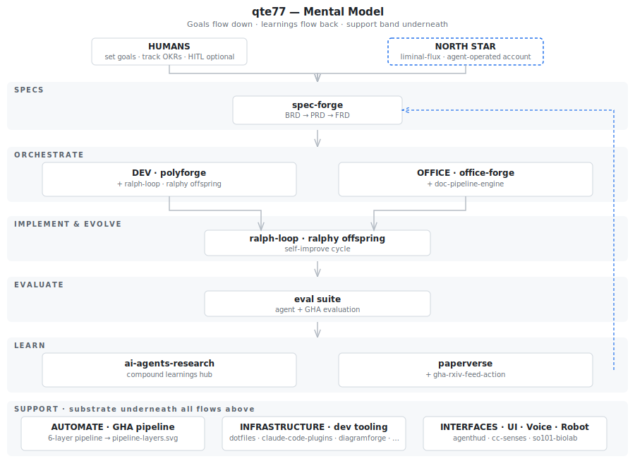
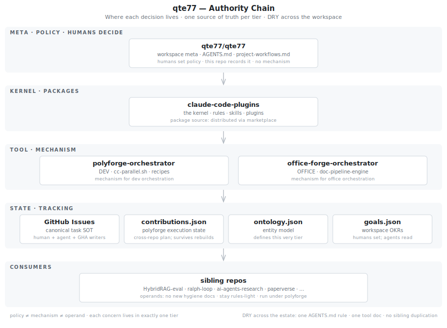
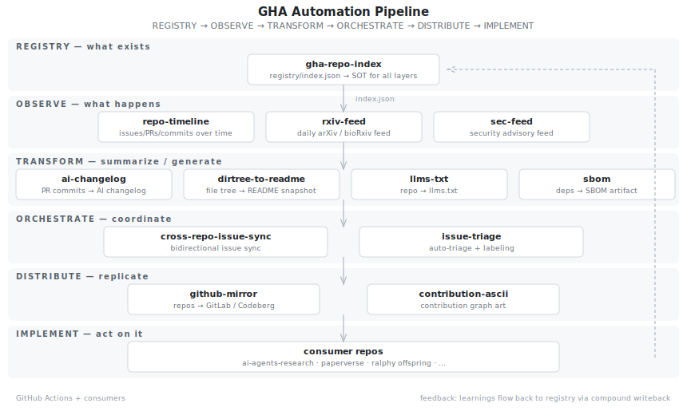

<!-- markdownlint-disable-file MD033 - Inline HTML -->
<!-- https://github.com/DavidAnson/markdownlint/blob/v0.25.1/doc/Rules.md#md033 -->

  <picture>
    <source media="(prefers-color-scheme: dark)" srcset="brand/images/wordmark_dark.dejavu.png">
    
  </picture>

**qte77** hosts a framework for compounding agentic work — keeping goals, specs, builds, and learnings in one feedback loop instead of drifting. Agents drive it; humans approve and steer. Proof: 30+ repos running on it here.

## Mental Model

Agentic development across 30+ repos drifts without a shared map. This fixes the feedback loop from learnings back to specs so the system compounds instead of forgetting.

Read it as: goals at the top feed specs, specs feed builds, builds emit learnings, and learnings flow back into the next goals.

### Authority Chain

Policy, mechanism, and state get confused and duplicated across repos. Naming where each decision lives prevents the drift and keeps 30+ repos DRY.

  
Diagram: META, KERNEL, MECHANISM, STATE, CONSUMERS

  

  
GHA automation pipeline — the GitHub Actions running across the ecosystem

  

### What this means concretely

- **Agents** — Claude Code (and compatible LLM coding agents) running per-repo, coordinated by orchestrators in this workspace.
- **Office work** — real workflows where humans and agents collaborate, orchestrated by office-forge and powered by the wider qte77 framework (engines like doc-pipeline-engine handle the heavy lifting).
- **Engines** — reusable components orchestrators compose: [doc-pipeline-engine](https://github.com/qte77/doc-pipeline-engine) (document processing) and [polyfetch-scrape](https://github.com/qte77/polyfetch-scrape) (HTTP scraping with anti-bot fallback).
- **Humans** — approve goals, review PRs, and steer the orchestrators. Agents propose; humans decide.
- **Where to look** — start with [polyforge-orchestrator](https://github.com/qte77/polyforge-orchestrator) for the dev loop or [office-forge-orchestrator](https://github.com/qte77/office-forge-orchestrator) for the office loop. 30+ companion repos live as siblings under [qte77](https://github.com/qte77?tab=repositories).

## Get started

- Dev loop → [polyforge-orchestrator](https://github.com/qte77/polyforge-orchestrator)
- Office loop → [office-forge-orchestrator](https://github.com/qte77/office-forge-orchestrator)
- Engine sample → [doc-pipeline-engine](https://github.com/qte77/doc-pipeline-engine)

Each repo carries its own quickstart.

## Roadmap

- **Now** — GitHub-native (Actions, Issues, PRs); Claude Code agents.
- **Next** — spec-forge methodology landing in [claude-code-plugins](https://github.com/qte77/claude-code-plugins).
- **Later** — runtime portability: air-gapped, BYOM, your stack.

## Profile

### Topics

- Agentic Software Development, Autonomous Coding
- Self-Evolving Agents, Compound Learning
- Multi-Repo Orchestration, Cross-Repo Issue Sync
- AI Agent Evaluation, MAS Benchmarking
- Goal-Driven Lifecycle Management, OKR Traceability
- Claude Code Plugins, MCP Integrations
- Agent UI (AG-UI/A2UI), Voice (TTS/STT)
- Robotics, Bio-Lab Automation

### Interests

- GitHub Actions, CI/CD Automation
- Inductive Priors, Automatic Differentiation
- Data Centric vs Model Centric
- QML, Barren Plateaus

### Posts

<!-- BLOG-POST-LIST:START -->
- [Agentx Agentbeats Writeup](https://qte77.github.io/agentx-agentbeats-writeup/)
- [AI Agents-eval Comprehensive Analysis](https://qte77.github.io/ai-agents-eval-comprehensive-analysis/)
- [AI Agents-eval Enhancement Recommendations](https://qte77.github.io/ai-agents-eval-enhancement-recommendations/)
- [AI Agents-eval Papers Meta Review](https://qte77.github.io/ai-agents-eval-papers-meta-review/)
<!-- BLOG-POST-LIST:END -->

### Tools

<!--
  --><!--
  --><!--
  --><!--
  --><!--
  --><!--
  --><!--
  --><picture><source media="(prefers-color-scheme: dark)" srcset="https://github.com/devicons/devicon/blob/master/icons/git/git-plain.svg"></picture><!--
  --><!--
  --><!--
  --><picture><source media="(prefers-color-scheme: dark)" srcset="https://github.com/devicons/devicon/blob/master/icons/azure/azure-original.svg"></picture><!--
  --><!--
  --><!--
  --><!--
-->

### TODO

- [x] Kaggle Playgrounds
- [x] Kaggle Competitions
- [ ] Codewars Python
- [ ] Advent of Code

## Lineage

How the current system got here — proof of work, not required reading.

The spec-generation work started in [`context-engineering-template-legacy`](https://github.com/qte77/context-engineering-template-legacy) (2025-07-06), where the BRD → PRD → FRD pipeline first took shape. [`RAPID-spec-forge-legacy`](https://github.com/qte77/RAPID-spec-forge-legacy) carried it forward until archived (2026-04-26).
