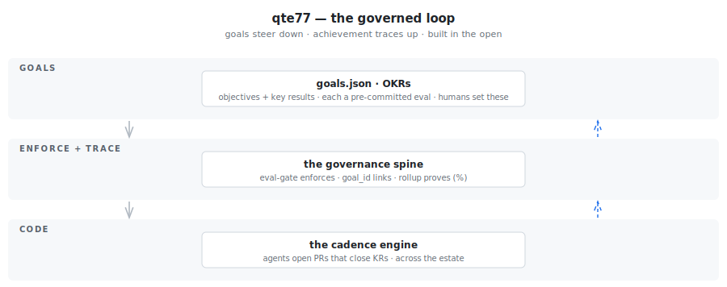

<!-- markdownlint-disable-file MD033 - Inline HTML -->
<!-- https://github.com/DavidAnson/markdownlint/blob/v0.25.1/doc/Rules.md#md033 -->

  <picture>
    <source media="(prefers-color-scheme: dark)" srcset="brand/images/wordmark_dark.dejavu.png">
    
  </picture>

**qte77** is a governed operating model for an agentic estate. Goals steer top-down, evals trace achievement bottom-up, all built in the open. Not a demo — a model to read, critique, and lift.

## What

qte77 runs an agentic estate as a governed loop — intent flows down, proof flows up:

Built from [polyforge-orchestrator](https://github.com/qte77/polyforge-orchestrator) (dev loop) and [office-forge-orchestrator](https://github.com/qte77/office-forge-orchestrator) (office loop), reusable engines ([doc-pipeline-engine](https://github.com/qte77/doc-pipeline-engine), [polyfetch-scrape](https://github.com/qte77/polyfetch-scrape)), and [ralph-loop](https://github.com/qte77/ralph-loop-cc-tdd-wt-vibe-kanban-template) driving the autonomous build-and-improve cycle. Agents propose; humans approve and steer. For how responsibility maps across repos, see the [authority chain](docs/architecture.md).

## How

Two ways in:

- **Run it** — start with an orchestrator: [polyforge](https://github.com/qte77/polyforge-orchestrator) (dev) or [office-forge](https://github.com/qte77/office-forge-orchestrator) (office); [doc-pipeline-engine](https://github.com/qte77/doc-pipeline-engine) is a sample engine.
- **Read it** — the [operating model](docs/operating-model.md) (the design plus its adversarial de-risking) and the [goal loop](docs/goals.md) (how intent becomes enforced and traced). Lift what's useful.

Companion repos live as siblings under [qte77](https://github.com/qte77?tab=repositories).

## Why

Run agents across many repos and it drifts into chaos — no shared goals, no traceability, no proof that "done" means "achieved." qte77 is the governance for exactly that: goals steer the work, a pre-committed eval gates every key result, and achievement traces back up — so the estate compounds instead of forgetting.

Built in the open, honestly: the rails ship before the goals, and what's live versus still dormant is shown as it is — see [STATUS.md](STATUS.md). It's a cross-repo operating model, not a single-repo agent runner; reach for something else if your loop fits in one repo or one prompt.

## Refs

- [Operating model](docs/operating-model.md)
- [Goal loop](docs/goals.md)
- [Architecture](docs/architecture.md)
- [Doc-structure contract](docs/doc-structure.md)
- [Contributing](CONTRIBUTING.md) · [Agent instructions](AGENTS.md)
- [Profile](PROFILE.md) · [Lineage](docs/lineage.md)

## License

Apache-2.0 — see [LICENSE](LICENSE).

## Tools

<!--
  --><!--
  --><picture><source media="(prefers-color-scheme: dark)" srcset="assets/images/icons/astral-dark.svg"></picture><!--
  --><!--
  --><picture><source media="(prefers-color-scheme: dark)" srcset="assets/images/icons/markdown-dark.svg"></picture><!--
  --><!--
  --><!--
  --><picture><source media="(prefers-color-scheme: dark)" srcset="https://github.com/devicons/devicon/blob/master/icons/git/git-plain.svg"></picture><!--
  --><!--
  --><!--
  --><picture><source media="(prefers-color-scheme: dark)" srcset="assets/images/icons/devcontainers-dark.svg"></picture><!--
  --><picture><source media="(prefers-color-scheme: dark)" srcset="https://github.com/devicons/devicon/blob/master/icons/azure/azure-original.svg"></picture><!--
  --><!--
  --><!--
  --><picture><source media="(prefers-color-scheme: dark)" srcset="assets/images/icons/ros-dark.svg"></picture><!--
  --><!--
  --><picture><source media="(prefers-color-scheme: dark)" srcset="assets/images/icons/gh-models-dark.svg"></picture><!--
  --><!--
  --><picture><source media="(prefers-color-scheme: dark)" srcset="assets/images/icons/mcp-dark.svg"></picture><!--
-->

## Posts

<!-- BLOG-POST-LIST:START -->
- [An Open Agentic Coding Harness — the Loop, the Plugins, the Senses, the Eval](https://qte77.github.io/open-agentic-coding-harness/)
- [Building a Trustworthy Agent Loop for a Physical Lab](https://qte77.github.io/open-self-driving-lab-agent-loop/)
- [A $150 Pipetting Robot from a Stock 3D Printer](https://qte77.github.io/pipettebot-sub-150-pipetting-robot/)
- [GraphJudge — Measuring How Agents Collaborate](https://qte77.github.io/agentx-agentbeats-writeup/)
<!-- BLOG-POST-LIST:END -->
