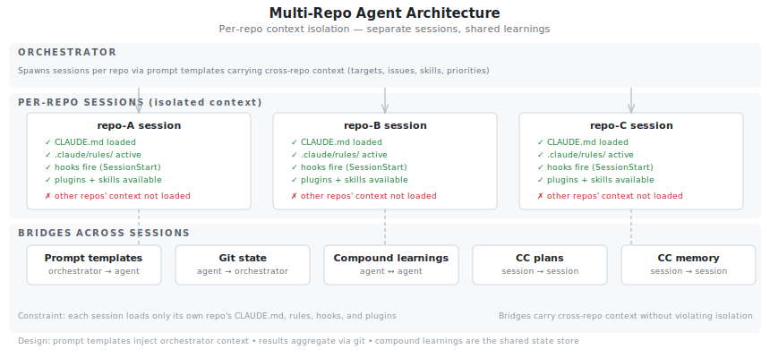
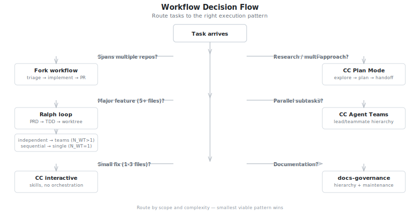
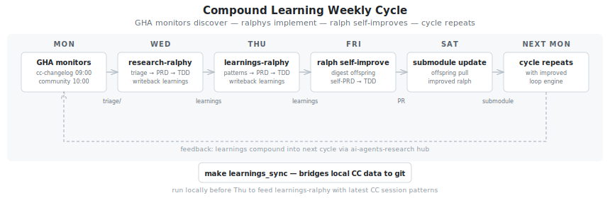

# Project Workflows

Unified decision flow for intra-project execution and inter-project orchestration.

## Multi-Repo Agent Architecture

CC agents load context from the repo they run in — CLAUDE.md, settings, rules, hooks,
and plugins are per-repo. Cross-repo work requires separate sessions.

<details>
<summary>Per-repo isolation model and 5 bridges across sessions</summary>



</details>

```text
Orchestrator (polyforge)
│
├─ spawns agent in repo-A/    → loads repo-A/.claude/*, CLAUDE.md, hooks
├─ spawns agent in repo-B/    → loads repo-B/.claude/*, CLAUDE.md, hooks
└─ spawns agent in repo-C/    → loads repo-C/.claude/*, CLAUDE.md, hooks
    │
    ├─ agents can READ files across repos (additionalDirectories)
    └─ agents do NOT get other repos' CLAUDE.md, rules, hooks, or plugins
```

**Constraints:**

- Per-repo session = full project context (CLAUDE.md, hooks, plugins fire correctly)
- Single session with `additionalDirectories` = only main repo's context loads
- Subagents inherit parent's context, not the target repo's

**Bridges across sessions:**

| Bridge | Direction | What it carries |
| ------ | --------- | --------------- |
| Prompt templates | Orchestrator → agent | Cross-repo context (targets, issues, skills, priorities) |
| Git state | Agent → orchestrator | Commits, branches, PRs (read via status scripts) |
| Compound learnings | Agent ↔ agent | Shared patterns via ai-agents-research/docs/learnings/ |
| CC plans | Session → session | Decisions persist at ~/.claude/plans/, loaded on next session |
| CC memory | Session → session | Per-project MEMORY.md, auto-loaded on conversation start |

**Design implications:**

- Prompt templates are the primary cross-repo context injection mechanism
- Per-repo CLAUDE.md stays lean (repo-specific only, not orchestration-level)
- Compound learnings hub (ai-agents-research) is the shared state store
- `learnings_sync` bridges local CC session data to the git-committed hub
- Results aggregate via git, not shared memory

## Decision Flow

<details>
<summary>Route tasks by scope: multi-repo → Plan Mode → Ralph → Agent Teams → interactive</summary>



</details>

```text
Task arrives
│
├─ Spans multiple repos?
│   → Inter-project workflow (see below)
│   → polyforge cc-parallel.sh for batch operations
│   → contrib preset for external fork targets
│
├─ Research / multi-approach design?
│   → CC Plan Mode (EnterPlanMode tool)
│   → Explore subagents for parallel codebase research
│   → Plan file persists at .claude/plans/ for handoff
│
├─ New repo or major feature (5+ files, clear stories)?
│   → PRD.md → Ralph submodule → make ralph_run (N_WT=1)
│   → Ralph uses lang-dev + tdd-core skills internally
│   │
│   ├─ Stories independent (no shared files)?
│   │   → Ralph teams mode (N_WT=3-5) OR CC Agent Teams
│   │
│   └─ Stories sequential?
│       → Ralph single worker (N_WT=1)
│
├─ Parallel subtasks within a conversation?
│   → CC Agent Teams (spawn teammates for independent work)
│   → OR Agent tool with subagent_type (lighter, no worktree)
│
├─ Small feature / bug fix (1-3 files)?
│   → CC interactive + skills (no Ralph, no plan mode)
│
└─ Documentation?
    → CC interactive + docs-governance skill
```

## Intra-Project: Ralph Teams vs CC Agent Teams

| Aspect | Ralph Teams (N_WT>1) | CC Agent Teams |
| ------ | -------------------- | -------------- |
| Orchestration | Bash scripts (parallel_ralph.sh) | CC-native lead/teammate |
| Isolation | Git worktrees | Git worktrees (v2.1.49+) |
| Communication | Shared prd.json + git | Mailbox messaging (SendMessage) |
| Quality gate | `make validate` per story | TeammateIdle/TaskCompleted hooks |
| TDD enforcement | Mandatory (commit markers) | Via tdd-core rules (advisory) |
| Plan approval | No | Yes — teammates plan, lead approves |
| Best for | Automated batch implementation | Interactive multi-agent collaboration |

## GHA Automation Pipeline

<details>
<summary>6-layer pipeline: REGISTRY → OBSERVE → TRANSFORM → ORCHESTRATE → DISTRIBUTE → IMPLEMENT</summary>


</details>

## Inter-Project: Multi-Repo Contribution

### Fork Workflow

External contributions follow fork-first:

1. Fork upstream repo under your account
2. Clone your fork locally
3. Add upstream remote (`git remote add upstream`)
4. Branch, implement (TDD), push to fork, PR to upstream

### Contribution Phases

**Triage** — explore codebase, assess issue complexity, post analysis comment on upstream.

**Implement** — strict TDD (Red-Green-Refactor), create branch, conventional commits, PR to upstream.

**Review** — check out open PR, review diff, run tests, post comment-only review.

### Parallel Execution

Independent repos can be worked on simultaneously — each gets its own agent session with per-project config (tech stack, skills, upstream target, default issues).

### Contribution Targets

**OSS Projects:**

| Project | Stack | Key Issues |
| ------- | ----- | ---------- |
| CraftsMan-Labs/SimpleAgents | Rust | #23 (complexity CI), #42 (approval), #44 (CC skills) |
| richlira/compass-mcp | TypeScript | Tests+CI, list_contexts, agent identity |
| Gitlawb/openclaude | TypeScript | PR#268 (3P params), PR#278 (gRPC), PR#218 (router) |
| OpenClaudia/openclaudia-skills | JS/Markdown | #7 (descriptions), #2 (CI validation) |

**patent-dev (Go):**

| Project | Key Issues |
| ------- | ---------- |
| patent-dev/epo-ops | #1 (proxy cache), #2 (XML parsing) |
| patent-dev/bulk-file-loader | Test coverage, docs |
| patent-dev/uspto-odp | Test coverage, docs |
| patent-dev/dpma-connect-plus | Test coverage, docs |
| patent-dev/epo-bdds | Test coverage, docs |

### Priority Matrix

```text
IMMEDIATE (trust builders, all parallelizable)
├── SimpleAgents #23 (complexity CI)
├── compass-mcp tests+CI+list_contexts
├── openclaude PR#268 review
├── openclaudia #7+#2
└── patent-dev epo-ops #1+#2

SHORT-TERM (high value)
├── SimpleAgents #42 (approval system)
├── compass-mcp agent identity + multi-workspace
├── openclaude PR#361 (rate limiting)
└── openclaudia release-notes skill

STRATEGIC (steer direction)
├── SimpleAgents #44 (CC skills interop)
├── compass-mcp change notifications
├── openclaude PR#278+#218 (gRPC+router)
└── openclaudia manifest standardization
```

## Compound Learning

<details>
<summary>Mon monitors → Wed/Thu ralphys implement → Fri ralph self-improves → cycle repeats</summary>



</details>

### Learnings Sync

Local CC session data → distilled learnings → committed to git → ralphys consume:

```bash
make learnings_sync   # bigpicture + plan-learnings → ai-agents-research
```

### Self-Evolution Cycle

```text
Mon    GHA monitors discover (ai-agents-research)
Wed    research-ralphy: discoveries → PRD → TDD → writeback
Thu    learnings-ralphy: patterns → PRD → TDD → writeback
Fri    ralph self-improve: digest offspring → self-PRD → TDD
Sat    offspring update ralph submodule
```
